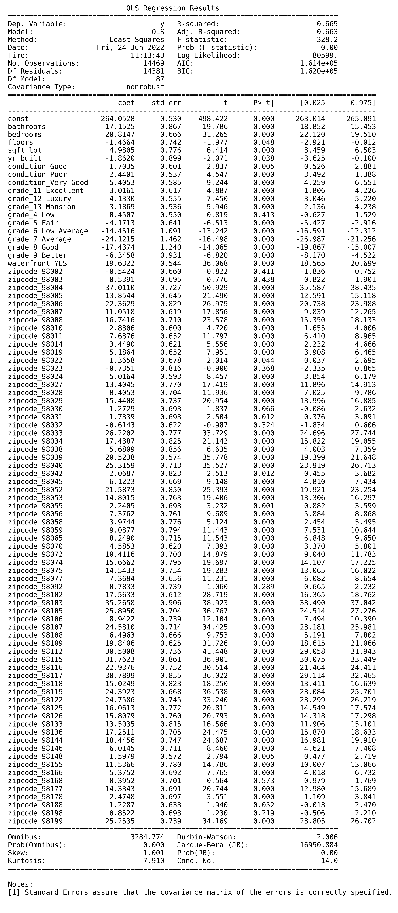
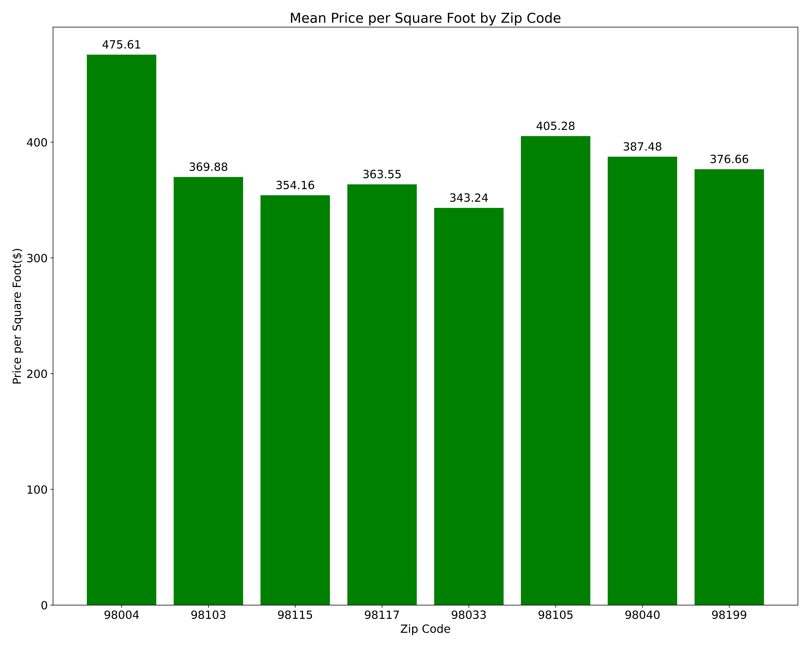

# Real Estate Investment Opportunities in King County
Authors: Anton Smirnov, Tom Chapman

## Overview
The King County housing market is one of the hottest in the country, remaining resilient even through worseniing economic conditions in the 2nd quarter of 2022. For this project, we will utilize linear regression modelling to analyze sales data and provide recommendations to investors looking to get in on the fun.

## Business Problem
We (Atoman Research) are based in King County and working on a project for a real estate investment trust. They would like us to use our area expertise to advise them on what sort of properties are likely to maximize the value of their investment. They have been tight-lipped about their plans for the properties they purchase, so we do not know if they intend to buy and hold, rennovate, demolish and rebuild, etc.

## Data Understanding
For this analysis we utilized a dataset of King County sales records collected over a 12 month period. Although the data dates back to 2014-2015, the age of the data has no impact on the recommendations presented herein. Therefore we treat the data as if it were current. The dataset includes all of the satndard datapoints one would expect when describing home sales. 

Because we aim to maximize the value of our clients' investment, we do not believe home price is the most meaningful target variable. Certainly a higher sale price is appealing, but we must also consider the risk that comes with large individual investments. Expensive homes have a limited pool of buyers, even in a wealthy locale like King County. We will focus our analysis on the price per square foot of the properties in our data in order to allow our clients to make investment decisions that match their specific fund sizes and risk tolerances.

## Modelling
Our modelling efforts included a dummy regressor model, a simple linear regression model, and two multiple linear regression models. The models are presented in order within the [completed notebook](king_county_final.ipynb) from simplest to most complex to demonstrate our iterative process. For the purposes of this summary, we will focus on the final multiple linear regression model which includes all of the features we utilized.

Our final model's target feature was price (USD) per square foot and included the following features:
* Number of Bedrooms
* Number of Bathrooms
* Lot Square Footage
* Number of Floors
* Waterfront (Yes or No)
* Property Condition
* Building Grade
* Year Built
* Zip Code

## Results
In this section, we will discuss the performance and validity of our model, as well as the impact of certain features with the largest correlation coefficients. Note that some of the data referenced here appears below the written work, specifically the train/test comparisons of R2 and RMSE.

With an R2 score of 0.665, we can say that our model captures ~66% of the variance in price per square foot that our features can collectively explain. As noted above, there are small issues with multicolinearity that could be addressed in future iterations to improve the model. Encouragingly, our model performed very similarly on our test and train data, with no significant difference in either R2 or RMSE scores. This suggests that the model is functioning with relatively low bias and low variance. While the absolute R2 score leaves much to be desired, our model does not seem to be under or overfitted. Additional features could be added to improve R2.

The root mean squared error score of 63.94 on the test data signifies that our model will generally have error of $63.94 per square foot of a property. Compared with the mean price per square foot in the test data of $264.29, a $63.94 error is significant, particularly when properties can be several thousand square feet. However, the RMSE is well within one standard deviation of the price per square foot in the test data, which measured $110.42. Comparisons to the train data were similar, with a root mean squared error score of 63.53, compared to mean price per square foot of $264.05 and a standard deviation of $109.78.

Our 12 strongest coefficients (ranging from 37.01 for zip 98004 to 24.39 for zip 98119) are all related to the zip codes in which the properties are located, suggesting that the attributes of a zip code have significant impact on property value. Following these appealing zip codes, building grade 7, which was labeled 'average' carried the next largest impact on price per square foot, with a negative coefficient of -24.12. Perhaps unsurprisingly, the waterfront feature had a coefficient of 19.63, suggesting that a waterfront property can expect an increase of $19.63 per square foot.

Based on our evaluation of model performance, we believe its use is warranted provided further effort goes into reducing outliers in the data.

Zip Codes with the highest impact on price per square foot are visualized as follows:

The mean price per square foot in our target zip codes is displayed below:

## Conclusions

Our final model performed similarly on the train and test data, and with an R2 score of 0.66, it is approaching a usable model. Further iteration is needed to address small issues with multicolinearity and address the presence of outliers in both the train and test data. We identified the following features and their correlation coefficients that had the strongest positive or negative impacts on price per square foot in King County:

* __Zip Codes 98004 (37.01), 98103 (35.27), 98115 (31.76), 98117 (30.79), 98112 (30.50),  98033 (26.22), 98105 (25.90), and 98040 (25.32).__ Considering that school districts, traffic patterns, proximity to amenities, crime, etc. all vary with zip code, it is reasonable to expect that the difference between our baseline zip code of 98001 and certain others will have a significant impact on property value. The baseline zip of 98001 is primarily associated with Auburn, WA, an inland suburb situated about halfway between Seattle and Tacoma. We chose this as a baseline because it is close enough to have access to Seattle-area amenities but far enough away to be more reasonably priced than some of the urban areas.

* __Building Grades 7 (-24.12) and 8 (-17.44).__ While building grades are quite subjective, these two grades most closely define average quality of construction methods and materials. Each has a negative impact on price per square foot, with grade 7 and 8 having correlation coefficients of -24.12 and -17.44, respectively. One might assume that given the climate, proximity to salt water and steep hills present in King County, buyers prize quality materials and construction methods that will last in a hostile environment.

* __Bedrooms (-20.82).__ All else being equal, each additional bedroom had a negative effect on price per square foot of \\$20.81. At first blush this is surprising, but square footage that is used for bedrooms is not being utilized for spaces that are more closely associated with home value such as kitchen and entertaining space. Further analysis would be needed to more fully explain the negative correlation of bedrooms and price per square foot in King County.

* __Waterfront Property (19.63).__ Perhaps the least surprising finding in the study, a property's designation as waterfront had a positive impact on price per square foot. The correlation 

Based on these findings, we would recommend that would-be investors center their property searches within these zip codes, and avoid properties built with average materials. To the extent waterfront property is available and priced appealingly, it should be the first stop for investors in King County.

## Next Steps

Given that our final model only captures ~66% of the variance in price per square foot that our features can collectively explain, further iterations of the model could prove useful. We specifically recommend the following areas for additional analysis:

- Addition of new features to help improve R2 score.
- Address outliers present in the dataset.
- Further analysis of the many components of zip code. This feature is a proxy for many different data points, and drilling down on them could lead to improved performance.

## For More Information

See the full analysis in the [Jupyter Notebook](king_county_final.ipynb) or review [this presentation](king_county_presentation.pdf).

For additional info, contact Tom Chapman or Anton Smirnov as follows:

- Anton:  antonalekssmirnov@gmail.com  
- Tom:    thomas.h.chapman@gmail.com
 
## Repository Contents
- data
- images
- working notebooks
- .gitignore
- README.md
- king_county_presentation.pdf
- king_county_final.ipynb

 